# 00 — Recon: Ist-Stand NalaERP3

> Erstellt im Rahmen von Phase 0 (aufgabe.md Abschnitt 3). Reine Bestandsaufnahme,
> keine Codeänderung. Jede Aussage ist mit Datei-/Zeilenbeleg versehen; wo das
> nicht möglich war, ist es als Einschätzung gekennzeichnet.

---

## 1 | Verzeichnisbaum (Tiefe 3) mit Zweck je Ordner

```
NalaERP3/
├── client/                          Flutter-Web-Client
│   ├── lib/                         App-Code
│   │   ├── pages/                   16 fachliche Screens (Dashboard, Projekte, Angebote, Aufträge, …)
│   │   ├── widgets/                 wiederverwendbare Widgets (aktuell 1 Datei)
│   │   ├── web/                     Conditional-Export für Web-APIs (localStorage, Datei-Picker)
│   │   ├── api.dart                 zentraler ApiClient (2048 Zeilen, ALLE Backend-Calls)
│   │   ├── main.dart                App-Bootstrap, AuthGate, LoginPage
│   │   └── *.dart (Root)            Cross-Cutting-Helper (commercial_*, material_*, purchase_order_*, stock_movement_*)
│   ├── test/                        genau 1 Testdatei (5983 Zeilen, Unit+Widget gemischt)
│   ├── web/                         statische Web-Assets (index.html, favicon, manifest)
│   └── Dockerfile
├── server/                          Go-API
│   ├── cmd/api/main.go              Einstiegspunkt
│   ├── internal/
│   │   ├── accounting/              Debitoren, Journal, Zahlungen, Bank (4 Dateien, 0 Tests)
│   │   ├── app/                     Server-Bootstrap/Wiring
│   │   ├── auth/                    User/Rollen/Permissions/Sessions (JWT+Redis)
│   │   ├── config/                  Env-Konfiguration
│   │   ├── contacts/                CRM (Kunden/Lieferanten)
│   │   ├── db/                      Postgres/Mongo/Redis-Clients
│   │   ├── hr/                      Mitarbeiter/Urlaub (1 Datei, 0 Tests)
│   │   ├── http/                    Router + alle HTTP-Handler (v1.go, 3683 Zeilen)
│   │   ├── materials/                Artikelstamm, Lager, Dokumente
│   │   ├── migrate/                 Migrationsrunner + aktives migrations/-Verzeichnis (68 SQL-Dateien)
│   │   ├── pdfgen/                  PDF-Erzeugung (gofpdf)
│   │   ├── projects/                Projekte, LogiKal-Import, Phasen/Elevationen
│   │   ├── purchasing/              Bestellwesen
│   │   ├── quotes/                  Angebote, GAEB-Import, Preisfindung, Freigabe (größtes Paket, 4870 Zeilen)
│   │   ├── sales/                   Aufträge (1032 Zeilen, 0 Tests)
│   │   ├── settings/                Nummernkreise, PDF-Templates, Firmenprofil
│   │   ├── testutil/                Integrationstest-Helfer (echte PG/Mongo/Redis, kein Testcontainer)
│   │   └── version/                 Build-Versionsinfo
│   ├── migrations/                  **verwaist**: 9 alte SQL-Dateien (001-008), nirgends referenziert
│   └── Dockerfile
├── docs/                            >180 Markdown-Dateien, davon >150 mit Präfix `gaeb_*`
│                                     (iterative Kleinstschritt-Protokolle: *_strategy/*_audit/*_inventory.md)
│                                     — kein docs/backlog.md, kein docs/state.md, kein docs/adr/ vor dieser Session
├── .github/workflows/ci.yml         CI: changes-Filter → server/integration/client/docker Jobs
├── docker-compose.yml               Produktiv-Compose (api, client, postgres, mongo, redis)
├── docker-compose.test.yml          Test-Compose (separate Ports für Integrationstests)
├── logi.sql                         Beispiel-SQLite-Export aus LogiKal (Referenzschema für Import)
├── AGENTS.md / README.md            gepflegte Projektdoku (Build/Test-Kommandos, Endpunkt-Beispiele)
├── codex.md                         State-Tracking eines vorherigen Agenten-Laufs ("Codex"), Format 3.1.x.y
├── anweisung.md                     Vorgänger-Prompt (v1) des jetzigen aufgabe.md, mit eigenem Backlog-Baum
└── aufgabe.md                       aktueller Auftrags-Prompt (v2), Grundlage dieser Session
```

---

## 2 | Stack, Versionen, Build-/Testkommandos

| Bereich | Befund | Beleg |
|---|---|---|
| Server-Sprache | Go 1.24.0 | `server/go.mod:3` |
| Web-Framework | `go-chi/chi v5.2.3` | `server/go.mod:6` |
| DB-Treiber | `jackc/pgx/v5 v5.7.6` (Postgres), `go.mongodb.org/mongo-driver v1.17.6`, `redis/go-redis/v9 v9.17.2` | `server/go.mod:7,10,9` |
| PDF | `jung-kurt/gofpdf v1.16.2` | `server/go.mod:8` |
| Client | Flutter, SDK `>=3.5.0 <4.0.0`, Paket-Version `0.6.1+1` | `client/pubspec.yaml:6,4` |
| Client-Deps | nur `http`, `http_parser`, `google_fonts`, `cupertino_icons`, `flutter_localizations` — **kein** State-Management-Package | `client/pubspec.yaml:9-16` |
| Datenbanken (Compose) | Postgres 17, Mongo 7, Redis 7 | `docker-compose.yml:40,60,74` |
| Deployment | Docker + `docker-compose.yml`, Multi-Stage-Dockerfiles je Service | `docker-compose.yml`, `server/Dockerfile`, `client/Dockerfile` |
| Lizenzen (Direkt-Deps) | chi (MIT), pgx (MIT), gofpdf (MIT), go-redis (BSD-2), mongo-driver (Apache-2.0), google_fonts/http/cupertino_icons (BSD-3/MIT) — alle mit den Vorgaben aus aufgabe.md §2 vereinbar; keine AGPL/proprietären Treffer | `server/go.mod`, `client/pubspec.yaml` |

**Build-/Testkommandos** (aus README.md/AGENTS.md, durch CI bestätigt):

```bash
# Server
cd server && go build ./cmd/api
cd server && go test ./...                      # Unit-Tests (Integrationstests standardmäßig übersprungen)
gofmt -l .                                        # muss leer sein (CI-Gate)

# Integrationstests (brauchen laufendes docker-compose.test.yml)
NALA_INTEGRATION=1 TEST_POSTGRES_DSN=... TEST_MONGO_URI=... TEST_REDIS_ADDR=... \
  go test ./internal/http

# Client
cd client && flutter analyze
cd client && flutter test
cd client && flutter build web --release --no-wasm-dry-run
```
Beleg: `.github/workflows/ci.yml:75-155`, `README.md:33-71`.

**CI-Status**: 4 Jobs (`server`, `integration`, `client`, `docker`), pfadgefiltert über `dorny/paths-filter` (`.github/workflows/ci.yml:15-55`). Kein separates Lint-Tool für Go über `go vet`/`golangci-lint` hinaus sichtbar (nur `gofmt`-Check, `.github/workflows/ci.yml:75-79`).

---

## 3 | Vorhandenes Datenmodell

**Wichtiger Befund zum aktiven Migrationsverzeichnis:** Die Anwendung bindet ausschließlich `server/internal/migrate/migrations/*.sql` per `go:embed` ein (`server/internal/migrate/migrate.go:14-15`), sortiert alphabetisch und führt jede Datei aus (`migrate.go:19-31`), aufgerufen beim Serverstart (`server/internal/app/server.go:56`). Der Ordner `server/migrations/` (9 Dateien, 001-008) wird **nirgends** referenziert — verwaister Altstand, vermutlich Merge-Artefakt.

Das aktive Verzeichnis selbst enthält **zwei überlappende Nummernketten** (z. B. `001_init.sql` **und** `001_projects.sql`; `007_alter_import_logs.sql`/`007_elevation_attrs.sql`/`007_projects.sql`; `013_alter_import_logs.sql`/`013_material_links.sql`; `014_material_dimensions_and_units.sql`/`014_seed_project_numbering.sql`). Da rein lexikographisch sortiert wird, laufen beide Ketten durch — praktisch folgenlos, weil überwiegend `CREATE TABLE IF NOT EXISTS`, aber ein klares Indiz für einen unsauberen Merge zweier Migrationshistorien in einem Verzeichnis. 68 Dateien insgesamt, aktuellster Stand `053_quote_approval_rework_resolved.sql`.

### Entitäten nach Domäne (Auszug, vollständige Liste s. Migrationsdateien)

- **Auth**: `users`, `roles`, `permissions`, `user_roles`, `role_permissions`, `auth_audit_log` (`017_auth.sql`)
- **Kontakte/CRM**: `contacts`, `contact_addresses`, `contact_persons`, `contact_notes`, `contact_tasks`, `contact_documents` (`003_contacts.sql`, `018-024`, `040`)
- **Materialien/Lager**: `materials`, `warehouses`, `locations`, `batches`, `stock_movements`, `material_documents`, `material_groups` (lose, ohne FK), `units` (`001_init.sql`, `002_material_documents.sql`, `013_material_links.sql`, `014`, `039`)
- **Bestellwesen**: `purchase_orders`, `purchase_order_items` (`004_purchase_orders.sql`)
- **Projekte/LogiKal**: `projects`, `project_phases`, `project_elevations`, `project_single_elevations`, `single_elevation_profiles/_articles/_glass`, `project_imports`, `project_import_changes`, `project_assets`
- **Angebote/Quotes**: `quotes` (mit `root_quote_id`/`superseded_by_quote_id` für Revisionierung), `quote_items`, `quote_text_blocks`, `quote_imports`, `quote_import_items`, `quote_import_item_links`, `quote_item_price_decisions`, `quote_calculation_settings`, `quote_item_approval_requests` (`032`, `041-053`)
- **Aufträge**: `sales_orders` (1:1 zu `quotes` via `source_quote_id`), `sales_order_items` (`034-038`)
- **Rechnungen/Accounting**: `tax_codes`, `accounts` (SKR04-Auszug), `journal_entries`, `journal_lines`, `invoices_out`, `invoice_out_items`, `invoice_out_payments`, `bank_statements` (`017_accounting_basics.sql`, `018_journal_and_ar.sql`, `019_opos_bank.sql`)
- **HR**: `hr_teams`, `hr_employees`, `hr_leave_requests`, `hr_absences`, `hr_holidays` (`020_hr_base.sql`)
- **Settings**: `pdf_templates`, `company_profiles`, `company_branches`, `company_localization_settings`, `company_branding_settings`, `number_sequences`

### Mermaid-ERD (Kernentitäten und Beziehungen)

```mermaid
erDiagram
    USERS ||--o{ USER_ROLES : hat
    ROLES ||--o{ USER_ROLES : hat
    ROLES ||--o{ ROLE_PERMISSIONS : hat
    PERMISSIONS ||--o{ ROLE_PERMISSIONS : hat
    USERS ||--o{ AUTH_AUDIT_LOG : erzeugt

    CONTACTS ||--o{ CONTACT_ADDRESSES : hat
    CONTACTS ||--o{ CONTACT_PERSONS : hat
    CONTACTS ||--o{ CONTACT_NOTES : hat
    CONTACTS ||--o{ CONTACT_TASKS : hat
    CONTACTS ||--o{ CONTACT_DOCUMENTS : hat

    WAREHOUSES ||--o{ LOCATIONS : hat
    MATERIALS ||--o{ BATCHES : hat
    MATERIALS ||--o{ MATERIAL_DOCUMENTS : hat
    MATERIALS ||--o{ STOCK_MOVEMENTS : bewegt
    WAREHOUSES ||--o{ STOCK_MOVEMENTS : lagert

    CONTACTS ||--o{ PURCHASE_ORDERS : liefert
    PURCHASE_ORDERS ||--o{ PURCHASE_ORDER_ITEMS : enthaelt
    MATERIALS ||--o{ PURCHASE_ORDER_ITEMS : bestellt

    CONTACTS |o--o{ PROJECTS : kunde
    PROJECTS ||--o{ PROJECT_PHASES : hat
    PROJECT_PHASES ||--o{ PROJECT_ELEVATIONS : hat
    PROJECT_ELEVATIONS ||--o{ PROJECT_SINGLE_ELEVATIONS : hat
    PROJECT_SINGLE_ELEVATIONS ||--o{ SINGLE_ELEVATION_PROFILES : hat
    MATERIALS |o--o{ SINGLE_ELEVATION_PROFILES : verlinkt
    PROJECTS ||--o{ PROJECT_IMPORTS : hat
    PROJECT_IMPORTS ||--o{ PROJECT_IMPORT_CHANGES : protokolliert
    PROJECTS ||--o{ PROJECT_ASSETS : hat

    PROJECTS |o--o{ QUOTES : bezieht_sich_auf
    CONTACTS ||--o{ QUOTES : kunde
    QUOTES ||--o{ QUOTE_ITEMS : enthaelt
    MATERIALS |o--o{ QUOTE_ITEMS : zugeordnet
    QUOTES |o--o{ QUOTES : revision_von
    QUOTES ||--o{ QUOTE_ITEM_PRICE_DECISIONS : hat
    QUOTES ||--o{ QUOTE_ITEM_APPROVAL_REQUESTS : hat
    USERS |o--o{ QUOTE_ITEM_APPROVAL_REQUESTS : entscheidet
    PROJECTS ||--o{ QUOTE_IMPORTS : hat
    QUOTES |o--o{ QUOTE_IMPORTS : erzeugt
    QUOTE_IMPORTS ||--o{ QUOTE_IMPORT_ITEMS : hat
    QUOTE_IMPORT_ITEMS ||--o| QUOTE_IMPORT_ITEM_LINKS : verlinkt

    QUOTES |o--o| SALES_ORDERS : wird_zu
    CONTACTS ||--o{ SALES_ORDERS : kunde
    SALES_ORDERS ||--o{ SALES_ORDER_ITEMS : enthaelt

    QUOTES |o--o| INVOICES_OUT : quelle
    SALES_ORDERS |o--o| INVOICES_OUT : quelle
    CONTACTS ||--o{ INVOICES_OUT : empfaenger
    INVOICES_OUT ||--o{ INVOICE_OUT_ITEMS : enthaelt
    ACCOUNTS ||--o{ INVOICE_OUT_ITEMS : bucht_auf
    INVOICES_OUT ||--o{ INVOICE_OUT_PAYMENTS : erhaelt
    INVOICE_OUT_PAYMENTS |o--o{ BANK_STATEMENTS : abgeglichen_mit
    JOURNAL_ENTRIES ||--o{ JOURNAL_LINES : enthaelt
    ACCOUNTS ||--o{ JOURNAL_LINES : bucht_auf

    HR_TEAMS ||--o{ HR_EMPLOYEES : hat
    HR_EMPLOYEES ||--o{ HR_LEAVE_REQUESTS : stellt
    HR_EMPLOYEES ||--o{ HR_ABSENCES : hat

    COMPANY_PROFILES ||--o{ COMPANY_BRANCHES : hat
```



### Mehrmandanten-/Mehrstandortfähigkeit

**Nicht vorhanden in den Fach-/Transaktionstabellen.** `company_branches.company_id` → FK zu `company_profiles` (`026_company_branches.sql:3`) ist die einzige echte Standort-Struktur, aber `company_profiles` ist als Singleton angelegt (`INSERT ... 'default' ... ON CONFLICT DO NOTHING`, `025_company_profile.sql:19-24`) und wird von **keiner** Fachtabelle referenziert. Weder `contacts`, `projects`, `quotes`, `sales_orders`, `invoices_out`, `purchase_orders` noch `users`/`roles` tragen `company_id`/`branch_id`/`tenant_id`. `number_sequences` sind global pro `entity`, nicht pro Mandant/Standort (`005_numbering.sql:1-7`). Das System ist faktisch **single-tenant**, obwohl aufgabe.md §2 Mehrmandantenfähigkeit "von Anfang an im Datenmodell" fordert.

### GoBD-Hinweise

Vorhanden: Nummernkreise (`number_sequences`), Kontenrahmen/Steuerkennzeichen (`accounts`, `tax_codes`), Journal-Soll/Haben-Struktur (`journal_entries`/`journal_lines`), Preisfindungs-Snapshot-Historie (`quote_item_price_decisions`), Freigabe-Snapshots (`quote_item_approval_requests`), LogiKal-Import-Änderungsprotokoll mit Vorher/Nachher-JSON (`project_import_changes.before_data/after_data`).

**Fehlend**: kein Storno-Status bei `invoices_out` (nur `draft|booked|paid`, `018_journal_and_ar.sql:20-21`), keine Soft-Delete-/Festschreibungs-Spalte in irgendeiner Tabelle (durchsucht, 0 Treffer), kein generisches Änderungsprotokoll über Fachobjekte hinweg (nur die zwei genannten domänenspezifischen Ausnahmen). Siehe Risiko #2 unten.

---

## 4 | API-Oberfläche

Produktiv verdrahtet über `NewRouterWithDeps()` (`server/internal/http/router.go:80`, aufgerufen in `server/internal/app/server.go:62`). Die ältere `NewRouter()` (`router.go:37`) ist Alt-/Test-Only-Code, produktiv nicht genutzt (nur `router.go:69`-Route `GET /api/v1/materials` ganz ohne Middleware — totes MVP-Fragment, kein reales Risiko, da nicht verdrahtet).

**Global-Middleware-Kette** (`router.go:83-95`): `RequestID` → `RealIP` → Request-Context → Access-Logging → Panic-Recovery → `AllowContentType` → CORS (`Access-Control-Allow-Origin: *`, `router.go:19`) → `Content-Language: de-DE`. Kein Rate-Limiting im gesamten Server (0 Treffer für `RateLimit|Throttle|limiter`).

**Umfang**: 175 produktive Endpunkte unter `/api/v1` (81 GET, 54 POST, 18 PATCH, 16 DELETE, 6 PUT), plus 4 ungeschützte Health/Version-Routen (`/livez`, `/readyz`, `/healthz`, `/version`).

| Domäne | Endpunkte | Auth-Modell | Beleg |
|---|---|---|---|
| `/auth` | 4 | login/refresh/logout öffentlich, `/me` mit `requireAuth` | `v1.go:78-150` |
| `/materials` | 10 | `requireAuth` + `materials.read/write` | `v1.go:152-290` |
| `/contacts` | 28 | `requireAuth` + `contacts.read/write` | `v1.go:293-609` |
| `/purchase-orders` | 9 | `requireAuth` + `purchase_orders.read/write` | `v1.go:612-789` |
| `/invoices-out` | 7 | `requireAuth` + `invoices_out.read/write` — **kein** `/invoices-in`-Pendant | `v1.go:791-994` |
| `/sales-orders` | 10 | `requireAuth` + `sales_orders.read/write` | `v1.go:996-1244` |
| `/quotes` (inkl. GAEB-Import, Pricing, Approval) | 42 (größte Domäne) | `requireAuth` + `quotes.read/write`, dediziert `quotes.approve` für Freigabe-Entscheidungen | `v1.go:1245-2154` |
| `/projects` (inkl. LogiKal-Import, Assets) | 30 | `requireAuth` + `projects.read/write` | `v1.go:2156-3020` |
| `/settings/*` | 28 | eine einzige `settings.manage`-Permission für GET+Write gemeinsam (Bruch mit read/write-Muster) | `v1.go:3021-3395` |
| `/documents`, `/workflow`, `/stock-movements`, `/warehouses` | 7 | jeweils eigene Permission | `v1.go:3398-3492` |

Middleware-Pattern: `requireAuth(authSvc)` (`v1.go:3587-3608`) + `requirePermission(code)` (`v1.go:3625-3642`). `requirePermission` lässt zusätzlich **jeden** Träger der Permission `users.manage` durch, unabhängig vom angeforderten Code (`v1.go:3634`) — impliziter globaler Superuser-Bypass, siehe Risiko #5.

Konsistenz: überwiegend REST-idiomatisch (Plural-Substantive, CRUD über GET/POST/PATCH/DELETE, PUT nur für Singletons), aber mit Einzelinkonsistenzen: gemischte Sprache in JSON-Response-Keys (`{"bestellung":..,"positionen":..}` bei Purchase-Orders vs. durchgehend englische Keys bei Sales-Orders/Quotes, `v1.go:646,655,1180,1203`), Bindestrich in URL vs. Unterstrich im Permission-Namen (`/purchase-orders` vs. `purchase_orders.read`), RPC-artige Workflow-Endpunkte (`/accept`, `/revise`, `/convert-to-*`) neben strikt CRUD-artigen Routen.

---

## 5 | Auth-/Rollenmodell

Vollständig vorhanden und funktional (nicht nur angelegt):

- **Datenmodell**: `users`, `roles`, `permissions`, `user_roles`, `role_permissions`, `auth_audit_log` (`017_auth.sql`). 8 System-Rollen (admin/sales/procurement/inventory/finance/hr/production/fleet), granulare Permission-Codes (`materials.write`, `quotes.approve`, …).
- **Login/Token**: eigenbau-HS256-JWT (`server/internal/auth/service.go:248-273`, kein Standard-JWT-Package), Access-TTL 15 Min/Refresh-TTL 12 h (env-konfigurierbar, `config.go:56-67`), Session-Store in **Redis** (bestätigt README-Aussage, `server/internal/auth/store.go`). Logout löscht die Redis-Session → sofortige Invalidierung beider Tokens.
- **Passwort-Hashing**: bcrypt, `DefaultCost` (`service.go:323-333`), getestet (`service_test.go:20-40`). Keine Passwort-Policy außer Nicht-Leer-Check.
- **Middleware**: `requireAuth`/`requirePermission`, granular pro Route bzw. Route-Gruppe (s.o.).
- **Mandantenfähigkeit**: nicht vorhanden (s.o.).
- **Lücken**: `JWT_SECRET=change-me` als Default ohne Produktions-Guard (`.env.example:27`, Go-Fallback `dev-secret-change-me` in `config.go:55`); kein Rate-Limiting auf `/auth/login`; `is_locked`-Feld existiert, wird aber nie automatisch gesetzt (kein Failed-Login-Counter); kein User-Management-Endpoint (Provisionierung nur per Direkt-SQL, `INSERT INTO users` kommt im Produktivcode nirgends vor, nur in `testutil/integration.go:98`); `users.manage` wirkt als globaler Bypass für jede Permission-Prüfung.

---

## 6 | Testabdeckung, Testarten, CI-Status

### Server (Go)

| Package | Quelldateien | Testdateien | Zeilen gesamt | Tests? |
|---|---|---|---|---|
| `accounting` | 4 | **0** | 887 | ❌ Finanzlogik ungetestet |
| `sales` | 1 | **0** | 1032 | ❌ Auftrags-/Rechnungskonvertierung ungetestet |
| `hr` | 1 | **0** | 241 | ❌ Personaldaten-CRUD ungetestet |
| `http` | 6 | 9 | 14758 | ✅ inkl. Integrationstests |
| `quotes` | 3 | 3 | 4870 | ✅ inkl. GAEB-Parser-Tests |
| `contacts`, `materials`, `projects`, `purchasing`, `settings`, `auth`, `pdfgen` | — | je ≥1 | — | ✅ |
| `app`, `config`, `db`, `migrate`, `testutil`, `version` | — | 0 | klein | Infrastruktur, geringes fachliches Risiko |

Integrationstests (`server/internal/http/*_integration_test.go`, `server/internal/testutil/integration.go`) laufen gegen **echte** Postgres/Mongo/Redis-Instanzen (kein Testcontainer/In-Memory), sind aber standardmäßig übersprungen und nur bei `NALA_INTEGRATION=1` aktiv (`testutil/integration.go:29-31`) — in lokalen `go test ./...`-Läufen ohne diese Env-Var bleibt ein erheblicher Teil der Testsuite ungeprüft.

Keine `TODO`/`FIXME`/`HACK`-Marker im gesamten `server/`-Baum. Keine unbehandelten DB-Write-Fehler gefunden (`_ = ...`-Stellen betreffen ausschließlich unkritisches `Close()`-Cleanup). Ein funktionaler No-Op-Bug: `server/internal/hr/service.go:98-100` (`if e.Active == false { e.Active = false }`).

### Client (Flutter)

Nur **eine** Testdatei: `client/test/sales_order_context_pages_test.dart` (5983 Zeilen, ~25 Unit- + ~65 Widget-Tests gemischt). Von 16 Seiten unter `client/lib/pages/` sind 9 (56 %) darüber abgedeckt. **Ungetestet**: `bank_statements_page.dart`, `contact_detail_screen.dart`, `contacts_screen.dart`, `employees_page.dart`, `materials_page.dart`, `settings_page.dart` (2312 Zeilen, zweitgrößte Datei im Client), `warehouses_page.dart`. Auch `main.dart` (Login-/AuthGate-Flow selbst) hat keinen dedizierten Test.

### CI

4 Jobs (`server`, `integration`, `client`, `docker`), pfadgefiltert, s. Abschnitt 2. `Integration`-Job startet `docker-compose.test.yml` und setzt `NALA_INTEGRATION=1` explizit (`.github/workflows/ci.yml:97-104`) — die Integrationstests laufen in CI also tatsächlich, nur lokal per Default nicht.

---

## 7 | Top-10-Risiken (mit Beleg)

1. **GAEB-Parser deckt nicht das reale GAEB-Format ab.** `server/internal/quotes/gaeb_xml_subset_parser.go:19-33` liest ein selbstdefiniertes XML-Schema (`<gaeb><item position_no qty unit optional><description>`), kein GAEB DA XML 3.x, keine Phasen D81/D83/D84/D86, keine Positionsart-Unterscheidung, keine Los/Titel/Untertitel-Hierarchie. Domäne I (das erklärte Endziel laut aufgabe.md §1) baut damit auf einem Platzhalter-Format, nicht auf einem GAEB-Parser.
2. **Kein GoBD-konformes Storno-/Festschreibungskonzept im Schema**, obwohl aufgabe.md §2 das als "nicht verhandelbar" fordert. `invoices_out.status` kennt nur `draft|booked|paid` (`018_journal_and_ar.sql:20-21`), keine Soft-Delete-/Festschreibungs-Spalte in irgendeiner Tabelle, kein generisches Änderungsprotokoll über Fachobjekte.
3. **`accounting`- und `sales`-Pakete ohne jeden Test** trotz Finanz-/Buchungslogik: `server/internal/accounting/{ar,journal,payments,bank}.go` (887 Zeilen, Doppik/Zahlungsabgleich) und `server/internal/sales/service.go` (1032 Zeilen, Rechnungskonvertierung) — 0 `_test.go`-Dateien.
4. **Schwaches Auth-Secret-Management**: `JWT_SECRET=change-me` (`.env.example:27`) mit Code-Fallback `dev-secret-change-me` (`server/internal/config/config.go:55`), keine Startup-Prüfung gegen Produktivbetrieb mit Default-Secret; zusätzlich kein Rate-Limiting auf `/auth/login` (0 Treffer im gesamten Server).
5. **Impliziter globaler Superuser-Bypass**: `requirePermission()` lässt jeden Träger der Permission `users.manage` durch jede Prüfung, unabhängig vom angeforderten Code (`server/internal/http/v1.go:3634`). Kombiniert mit fehlendem User-Management-Endpoint (Rollenzuweisung nur per Direkt-SQL) ein Betriebs- und Governance-Risiko.
6. **`hr`-Paket: Personaldaten-CRUD ohne Tests und mit totem Code.** `server/internal/hr/service.go` (241 Zeilen, 0 Tests) verarbeitet Namen/E-Mail/Personalnummer; enthält einen No-Op-Bug (`service.go:98-100`), der auf unfertige/nicht reviewte Logik hindeutet.
7. **Zwei überlappende Migrationsketten im aktiven Verzeichnis** `server/internal/migrate/migrations/` (z. B. doppelte `001`/`007`/`013`/`014`-Nummern aus zwei Historien), lexikographisch sortiert ausgeführt — aktuell folgenlos durch `IF NOT EXISTS`, aber fragil bei künftigen Änderungen an denselben Tabellen aus beiden Ketten.
8. **Access-/Refresh-Token im Browser-`localStorage`** (`client/lib/web/browser_web.dart:67-75`) kombiniert mit vollständig offenem CORS (`Access-Control-Allow-Origin: *`, `server/internal/http/router.go:19`) — erhöhtes Risiko bei clientseitigem XSS, da Tokens per Script auslesbar sind und keine Origin-Beschränkung greift.
9. **Kein Mandanten-/Standort-Scoping in Fach-/Transaktionstabellen**, obwohl aufgabe.md §2 Mehrmandantenfähigkeit "von Anfang an im Datenmodell" fordert. Einzige Standortstruktur (`company_branches`) wird von keiner Beleg-/Bewegungstabelle referenziert.
10. **Dünne Client-Testabdeckung mit Einzeldatei-Architektur**: nur `client/test/sales_order_context_pages_test.dart` (5983 Zeilen) für den gesamten Client; 7 von 16 Seiten ungetestet, darunter `settings_page.dart` (2312 Zeilen) und der komplette Login-/AuthGate-Flow in `main.dart`.

*Nachrichtlich (nicht in Top 10, aber notiert):* IP-Adressen werden bei jedem Request/Error/Panic ungekürzt geloggt (`server/internal/http/observability.go:67-120`) ohne erkennbare DSGVO-Zweckbindung/Kürzung; verwaistes `server/migrations/`-Verzeichnis (9 Dateien) sollte bereinigt oder klar als Alt-Stand markiert werden.

---

## 8 | Was funktioniert nachweislich vs. was ist nur angelegt

### Nachweislich funktionsfähig (Code + grüne Tests vorhanden)

- Auth: Login/Refresh/Logout/Permission-Check inkl. Redis-Sessions, bcrypt-Hashing (`auth/service_test.go`).
- CRM (Kontakte, Adressen, Personen, Notizen, Aufgaben, Dokumente).
- Materialstamm, Lager (Bestände, Bewegungen), Bestellwesen inkl. PDF.
- Projekte inkl. LogiKal-Import/Re-Import mit Undo und Änderungsprotokoll.
- Angebote: CRUD, Revisionierung, Textbausteine, GAEB-Upload→Parse→Review→Draft-Quote-Workflow (End-to-End mit Integrationstests, `server/internal/http/quotes_integration_test.go`), Preisfindung aus Artikelstamm/Historie, margenbasierter Freigabe-Workflow mit Blockade von Invoice-/Sales-Order-Konvertierung bei offenem Rework.
- Aufträge: aus Angebot erzeugt, Statusfluss, Konvertierung zu Rechnung.
- Rechnungen (Ausgang): Buchung, Zahlungen, Bankabgleich, PDF — funktional vorhanden, aber ungetestet (s. Risiko #3).
- Settings: Nummernkreise, PDF-Templates, Firmenprofil/-branding, Einheiten, Materialgruppen.

### Nur angelegt / rudimentär / nicht begonnen

- **Domäne I (KI-Angebotserzeugung aus GAEB)**: kein LLM-Provider im Repo (0 Treffer in go.mod/pubspec.yaml/Volltextsuche), kein Confidence-Score-Feld, kein D84-Rückschreibe-Export, kein Evaluationsset, kein Provider-Interface. Nur das Datenfundament (Angebotsmodell, Preisfindung, margenbasiertes HITL) existiert — exakt wie aufgabe.md §1 als Vorbedingung beschrieben, aber I selbst ist offen.
- **HR**: dünnes Grundgerüst (Employee-/Leave-CRUD), keine Zeiterfassung, keine Weiterbildung/Qualifikationen, kein Asset-Management, kein Rollen-/Kapazitätsbezug.
- **Fuhrpark**: kein Code gefunden (kein Package, keine Migration mit `vehicle`/`fuhrpark`/`fleet`-Bezug außer der Auth-Rolle `fleet`, die aber auf keine Domänenlogik zeigt).
- **Produktionssteuerung**: kein Code gefunden (keine Fertigungsauftrags-/Stücklisten-/BDE-Tabellen).
- **Eingangsrechnungen/Kreditoren**: kein `/invoices-in`-Pendant zur Debitorenseite, keine Rechnungsprüfung gegen Bestellungen/Wareneingang im Code sichtbar.
- **E-Rechnung (XRechnung/ZUGFeRD)**: keine Treffer im Code.
- **DATEV-Export**: keine Treffer im Code.
- **Arbeitszeiterfassung**: keine Treffer über die einfache Urlaubs-/Abwesenheits-Tabelle hinaus.
- **Mehrmandantenfähigkeit**: nur als isolierte `company_branches`-Stammdatentabelle, keine Datentrennung.
- **Backlog/State-Infrastruktur laut aufgabe.md §5**: existierte vor dieser Session nicht (`docs/backlog.md`, `docs/state.md`, `docs/adr/`, `docs/open-questions.md` fehlten). Stattdessen informelles State-Tracking in `codex.md` (Format `Epic 3/Feature 3.1/Task 3.1.76/Subtask 3.1.76.1`) und ein Vorgänger-Backlog-Baum in `anweisung.md` — beide außerhalb der von aufgabe.md verlangten Struktur und mit inkompatibler Nummerierung.
